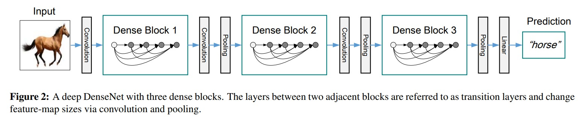
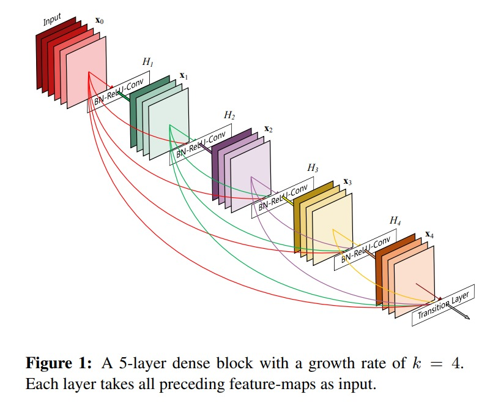
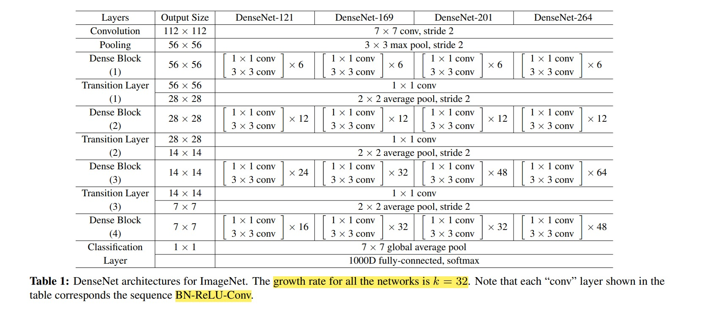

# DenseNet

## Densely Connected Convolutional Networks (DenseNet) by Gao Huang, Zhuang Liu, Laurens van der Maaten, Kilian Q. Weinberger

## Motivation

- The main idea of DenseNet is to connect each layer to every other layer in a feed-forward fashion.

- For each layer, the feature-maps of all preceding layers are used as inputs, and its own feature-maps are used as inputs into all subsequent layers. Hence total number of connections in a `L` Network is `L(L+1)/2`.

- DenseNets have several compelling advantages: they alleviate the `vanishing-gradient problem`, `strengthen feature propagation`, `encourage feature reuse`, and `substantially reduce the number of parameters`.

- In contrast to ResNet, DenseNet don't combine the feature-maps through summation, but through `concatenation`.

## History of Increasing Network's Depth

- `Skip-Connections` are used to increase the depth of the network. But the main problem with skip-connections is that there many layers contribute very little and can be safely removed without hurting the performance. This makes The `ResNet` similar to unrolled RNN but the number of parameters are substantially because each layer has its own weights.

- `Stochastic Depth` is used to address this problem. In this method, layers are dropped randomly during training. This shows that not all the layers may be needed and highlights that there is a great amount of redundancy in deep (Residual) networks.

- An orthogonal approach to making networks deeper (with the help of skip-connections) is to increase the network width. The GoogLeNet uses an `Inception module` which concatenates feature-maps produced by filters of different sizes.

- In `DenseNet`, authors `concatenate the feature-maps` of all layers this differentiates between the informaation that is added to the Network and the information that is preserved. Instead of drawing representational power from extremely deep or wide architectures, DenseNets exploit the potential of the network through `feature reuse`.

## terminology

**Growth Rate**: This determines the number of features maps output into individual layers inside dense block.

**Dense Connectivity**: By Dense connectivity, authors mean that each layer is connected to every other layer in a feed-forward fashion.

**Composite Function**: Each layer in the dense block is a composite function of `Batch Normalization`, `ReLU`, and `Convolution` this will be one convolution layer.

**Transition Layer**: It aggregates the feature maps from a dense blocka and reduce its dimensions. So Max Pooling is enabled in this layer

# My Observation:

- DenseNet is Exactly same as that of ResNet only difference is that in ResNet we `add` the input of current layer to the output of current layer but in DenseNet we `concatenate` the input of current layer to the output of current layer. 

- Because the input of a particular layer is already concatenated with the output of all the previous layers.