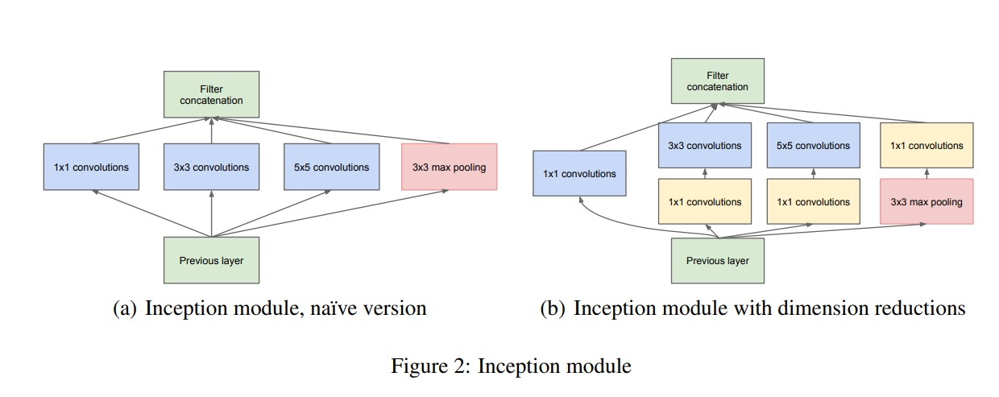

# Inception

## Inception by Christian Szegedy, Vincent Vanhoucke, Wei Liu, Yangqing Jia, Pierre Sermanet, Scott Reed, Dragomir Anguelov, Dumitru Erhan, Vincent Vanhoucke, Andrew Rabinovich 

# Motivation

Inception was designed in such a way so that we can have a network that is very deep and wide while keeping the computational cost low. The idea is to use a **1 × 1 convolution** to reduce the number of channels before the **3 × 3 convolution**. This reduces the number of parameters and computations in the network.

## Drawback of Bigger Networks

- Bigger size typically means a larger number of parameters, which makes the enlarged network more prone to `overfitting`, especially if the number of labeled examples in the training set is limited.

- Dramatically increased use of computational resources.

The fundamental way of solving both issues would be by ultimately moving from fully connected to sparsely connected architectures, even inside the convolutions.